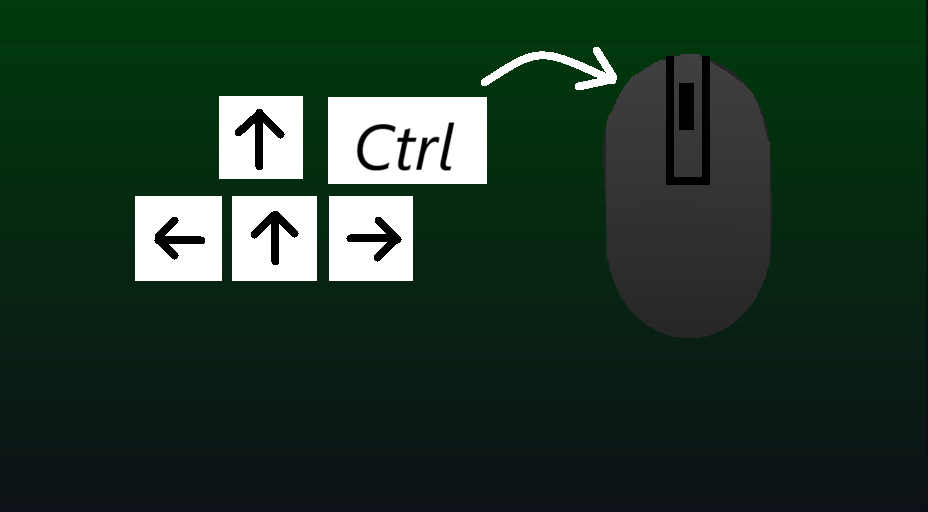

    <picture>
      <source media="(prefers-color-scheme: light)" srcset="./doc/readme/images/ktmlogo_light.png" />
      
  </picture>

<h1 align="center">UseKeyboardInstead</h1>
This is an application that gives you the ability to control your mouse with your keyboard.

## Default Keybinds
* Use the Control key and the arrow keys to move the mouse.
* Use the Alt key and the Left/Right arrow keys to Left/Right Click.
* Use the Alt key and the Up/Down arrow keys to Scroll Up and down.
* Use the Control, Alt, Up and Down arrow keys at the same time for Middle Click (if you don't know what it is, push down on your scroll wheel :D )

